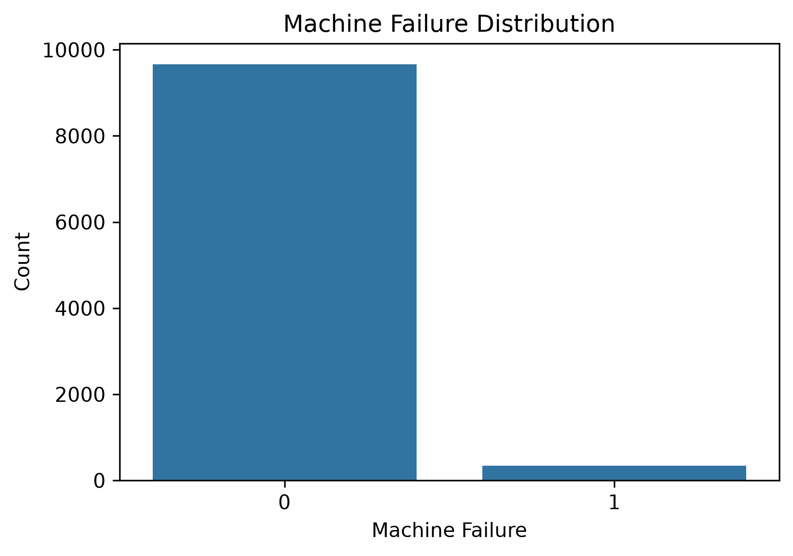
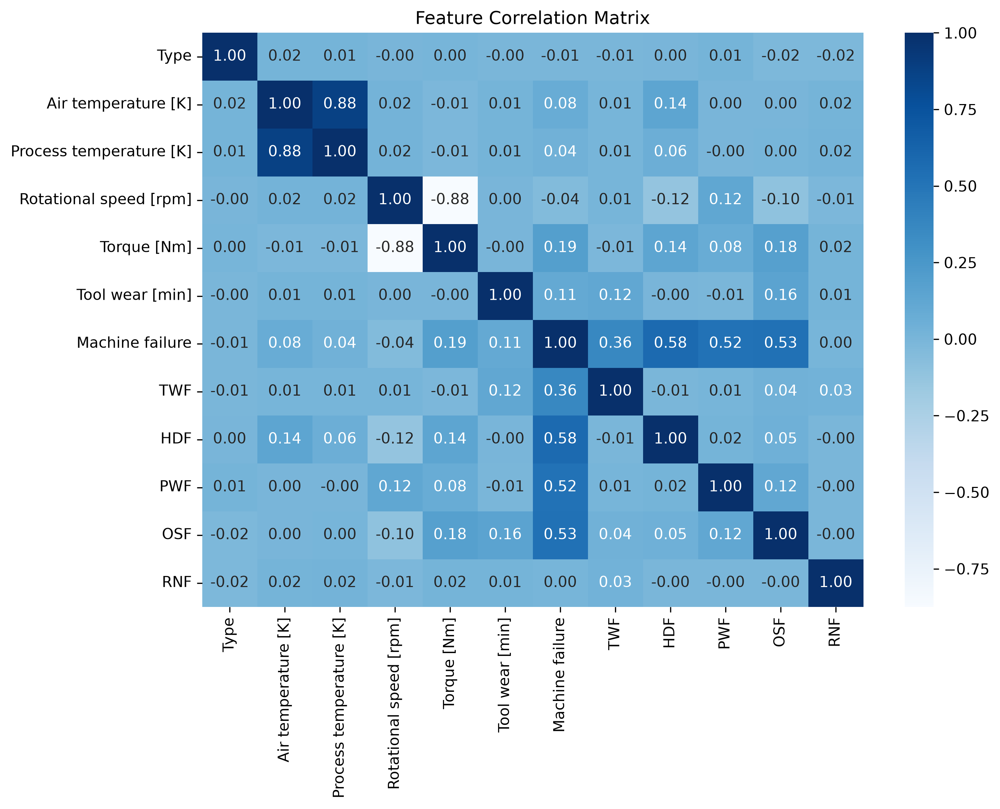
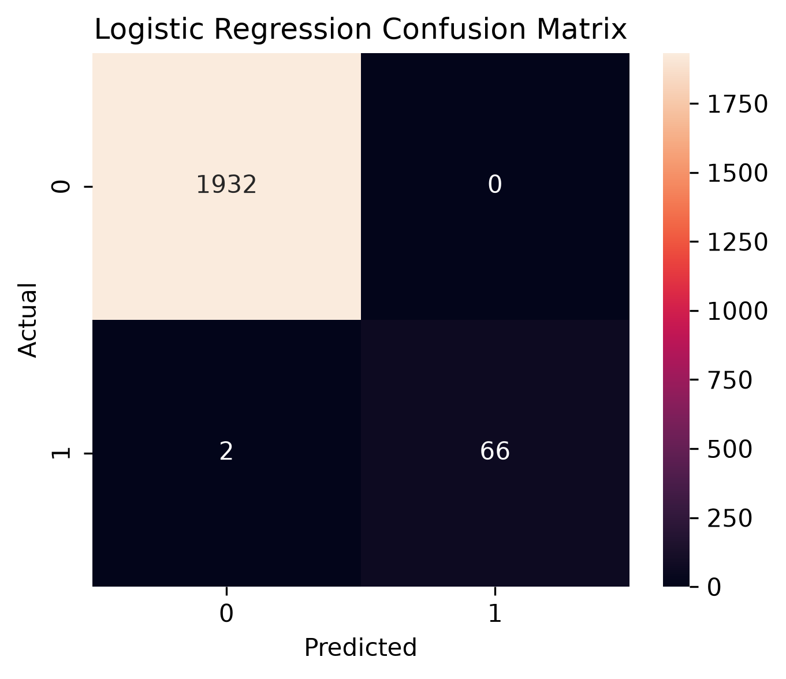

# Industrial Equipment Reliability Intelligence Platform

An end-to-end Machine Learning project focused on predicting industrial equipment failures using operational and sensor data. This project applies predictive maintenance techniques to identify potential machine failures before they occur, helping reduce unexpected downtime and support data-driven maintenance decisions.

The project follows a complete Machine Learning workflow, including data understanding, preprocessing, exploratory data analysis (EDA), feature engineering, model training, model comparison, and business insights.

---

## Project Overview

Industrial equipment failures can cause production delays, increased maintenance costs, and operational disruptions. Traditional maintenance approaches often depend on scheduled inspections or reactive repairs after equipment failure.

This project addresses this challenge by developing a machine learning-based predictive maintenance system that analyzes equipment conditions and predicts the possibility of failure.

The developed solution helps organizations move from reactive maintenance toward proactive, data-driven decision-making.

---

## Business Problem

Manufacturing environments generate large amounts of operational data from industrial equipment. However, identifying early warning signs of failure remains a challenge.

The objective of this project is to build a classification model that can analyze machine parameters and predict failures before they happen, allowing maintenance teams to take preventive actions.

---

## Project Objectives

- Analyze industrial equipment data and identify important patterns
- Perform data preprocessing and preparation for machine learning
- Conduct exploratory data analysis (EDA)
- Engineer meaningful features for better prediction
- Train multiple classification models
- Compare model performance using evaluation metrics
- Select and save the best-performing model
- Generate business insights for predictive maintenance

---

# Machine Learning Workflow

```
Data Understanding
        ↓
Data Preprocessing
        ↓
Exploratory Data Analysis
        ↓
Feature Engineering
        ↓
Model Training
        ↓
Model Comparison
        ↓
Model Selection
        ↓
Business Insights
```

---

# Repository Structure

```
Industrial-Equipment-Reliability-Intelligence-Platform
│
├── 01_Business_Documents
│
├── 02_Data
│   ├── Raw
│   └── Processed
│
├── 03_Notebooks
│   ├── 01_Data_Understanding.ipynb
│   ├── 02_Data_Preprocessing.ipynb
│   ├── 03_Exploratory_Data_Analysis.ipynb
│   ├── 04_Feature_Engineering.ipynb
│   ├── 05_Model_Training.ipynb
│   ├── 06_Model_Comparison.ipynb
│   └── 07_Business_Insights.ipynb
│
├── 04_Models
│   └── best_model.pkl
│
├── 05_Reports
│
├── 06_Images
│   ├── confusion_matrix.png
│   ├── correlation_heatmap.png
│   └── machine_failure_distribution.png
│
├── README.md
└── requirements.txt
```

---

# Dataset Information

**Dataset:** AI4I 2020 Predictive Maintenance Dataset

| Information | Details |
|-------------|---------|
| Total Records | 10,000 |
| Problem Type | Binary Classification |
| Domain | Industrial Predictive Maintenance |
| Target Variable | Machine Failure |

The dataset contains machine operational parameters and sensor measurements used to predict equipment failures.

---

# Exploratory Data Analysis

Exploratory Data Analysis was performed to understand:

- Feature distributions
- Relationships between variables
- Failure patterns
- Correlation between machine parameters

### Machine Failure Distribution




### Correlation Heatmap



---

# Data Preprocessing

The preprocessing phase included:

- Removing unnecessary identifiers
- Handling categorical variables
- Encoding features
- Preparing data for model training
- Splitting data into training and testing sets

---

# Feature Engineering

Feature engineering was performed to improve the model's ability to identify failure patterns.

Engineered features include:

- Temperature Difference
- Tool Wear Categories
- Additional operational indicators

These features helped capture relationships between equipment conditions and failure probability.

---

# Machine Learning Models

Multiple classification algorithms were trained and evaluated:

- Logistic Regression
- K-Nearest Neighbors (KNN)
- Random Forest
- Decision Tree

Models were evaluated using:

- Accuracy
- Precision
- Recall
- F1 Score
- Confusion Matrix

---

# Model Performance Comparison

| Model | Accuracy | Precision | Recall | F1 Score |
|---|---:|---:|---:|---:|
| **Logistic Regression** | **99.90%** | **100.00%** | **97.06%** | **98.51%** |
| K-Nearest Neighbors | **99.90%** | **100.00%** | **97.06%** | **98.51%** |
| Random Forest | 99.75% | 100.00% | 92.65% | 96.18% |
| Decision Tree | 99.70% | 94.29% | 97.06% | 95.65% |

### Best Performing Model

**Logistic Regression**

The selected model was saved for future predictions:

```
04_Models/best_model.pkl
```

---

# Confusion Matrix



The confusion matrix provides a detailed view of correct and incorrect predictions and helps evaluate the model's classification performance.

---

# Business Insights

The developed predictive maintenance approach can help organizations:

- Detect potential equipment failures earlier
- Reduce unexpected machine downtime
- Improve maintenance planning
- Support data-driven operational decisions
- Increase equipment reliability

---

# Technologies Used

## Programming Language

- Python

## Machine Learning & Data Science

- Pandas
- NumPy
- Scikit-learn
- Matplotlib
- Seaborn
- Joblib

## Development Tools

- Jupyter Notebook
- Visual Studio Code
- Git & GitHub

---

# Installation

Clone the repository:

```bash
git clone https://github.com/izharulhaqmemon/Industrial-Equipment-Reliability-Intelligence-Platform.git
```

Navigate to the project directory:

```bash
cd Industrial-Equipment-Reliability-Intelligence-Platform
```

Install required dependencies:

```bash
pip install -r requirements.txt
```

---

# How to Run

Run the notebooks in the following sequence:

1. `01_Data_Understanding.ipynb`
2. `02_Data_Preprocessing.ipynb`
3. `03_Exploratory_Data_Analysis.ipynb`
4. `04_Feature_Engineering.ipynb`
5. `05_Model_Training.ipynb`
6. `06_Model_Comparison.ipynb`
7. `07_Business_Insights.ipynb`

---

# Future Improvements

Possible future enhancements:

- Hyperparameter optimization
- Cross-validation
- Real-time failure prediction pipeline
- Interactive monitoring dashboard
- Model deployment using Flask or FastAPI
- Cloud-based deployment
- Automated model monitoring

---

# Author

**Izhar Ul Haq**

Software Engineering Undergraduate | AI/ML Enthusiast

GitHub: [izharulhaqmemon](https://github.com/izharulhaqmemon)

---

## License

This project is developed for educational and portfolio purposes.